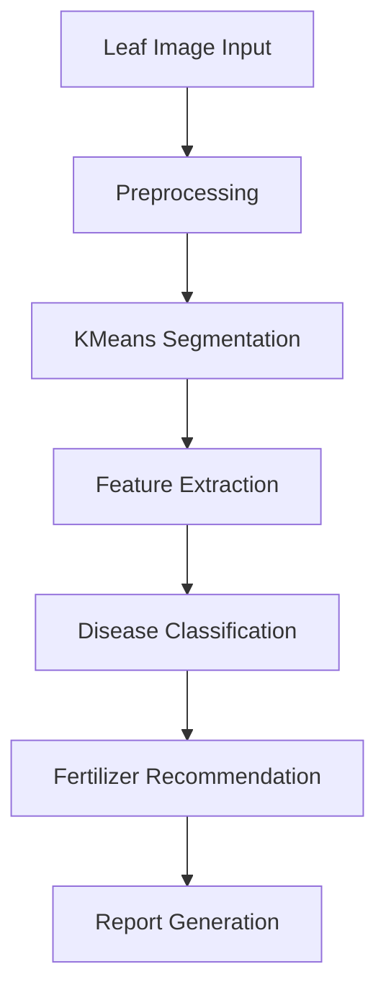

# Architecture

<!-- TODO: Add Mermaid diagrams in Phase 8 -->

## Pipeline Overview

```mermaid
graph TD
    A[Leaf Image Input] --> B[Preprocessing]
    B --> C[KMeans Segmentation]
    C --> D[Feature Extraction]
    D --> E[Disease Classification]
    E --> F[Fertilizer Recommendation]
    F --> G[Report Generation]
```

## Component Diagram

*To be completed in Phase 8.*
